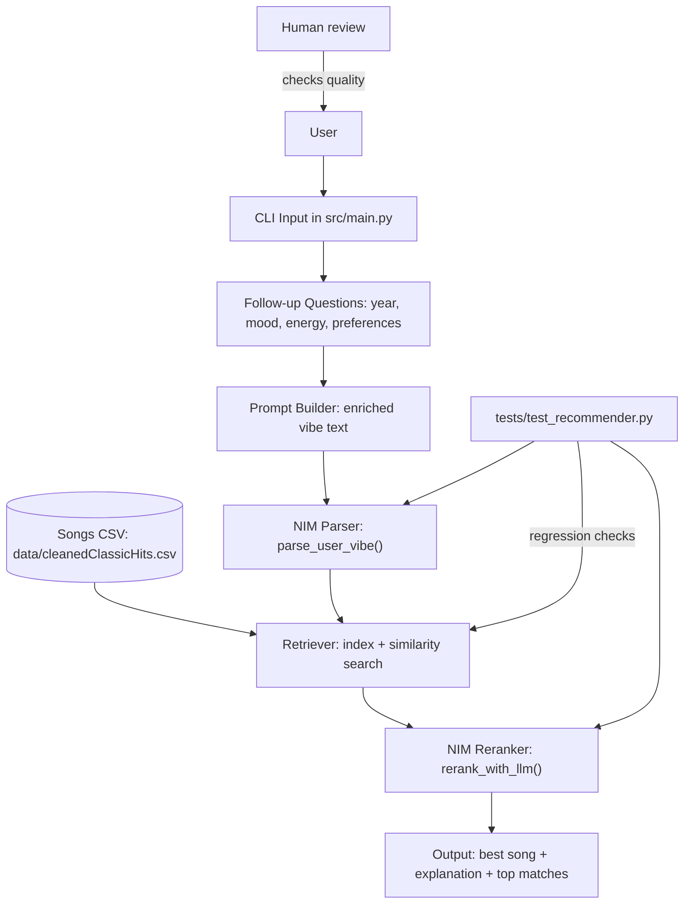

# Applied AI System Final: Modern-to-Classic Music Recommender

## Title and Summary

This project is a NIM-powered music recommendation system that translates a user's modern music taste into a best-fit song from earlier eras using a classic songs dataset. It matters because it combines natural-language understanding with structured retrieval to produce recommendations that are explainable, constrained (for example, by year), and interactive for users.

## Original Project (Modules 1-3)

This project originally was a music recommender system that pulled from a CSV sheet with fewer than 15 songs and recommended songs based on user preferences like genre, mood, and energy. The early version focused on manual scoring logic and simple profile matching. In this final version, the system has been expanded to a much larger dataset and upgraded with NIM-based parsing and reranking for more context-aware recommendations.

## Architecture Overview

The system follows a retrieval-plus-LLM workflow:

1. User enters a vibe and answers short follow-up questions in `src/main.py`.
2. The app builds an enriched prompt and calls NIM to parse preferences (`parse_user_vibe`).
3. Songs are loaded from `data/cleanedClassicHits.csv`, indexed, and retrieved by similarity (`recommend_from_vibe`).
4. NIM reranks top candidates and generates an explanation (`rerank_with_llm`).
5. The CLI prints the best match and top retrieved options.

Human and test checks happen in two places:
- Human-in-the-loop: user reviews recommendation quality and adjusts prompts.
- Automated checks: tests in `tests/test_recommender.py`.



## Setup Instructions

1. Clone the repository and enter the project folder.
2. Create and activate a virtual environment.
3. Install dependencies from `requirements.txt`.
4. Set your NIM API key (required).
5. Run the CLI app.

Example commands:

```bash
python3 -m venv .venv
source .venv/bin/activate
pip install -r requirements.txt
export NVIDIA_NIM_API_KEY="your_key_here"
python3 -m src.main
```

If you prefer, you can set `NIM_API_KEY` instead of `NVIDIA_NIM_API_KEY`.

## Sample Interactions

### Example 1
Input:
- Current taste: `i like electric pop`
- Songs before what year: `1920`
- Desired mood: `hype`
- Desired energy: `10`
- Preferred genres/artists + avoids: *(blank)*

Output (sample):
- Best old-time equivalent: `The Entertainer | Scott Joplin`
- Year: `1902`
- Explanation notes that electric pop maps well to energetic Ragtime traits.

### Example 2
Input:
- Current taste: `i like zany songs`
- Songs before what year: `1990`
- Desired mood: `dark`
- Desired energy: `10`
- Preferred genres/artists + avoids: *(blank)*

Output (sample):
- Best old-time equivalent: `Mirror Mirror - Remastered 2007 | Blind Guardian`
- Year: `1986`
- Explanation links high-energy/dark profile to late-1980s metal characteristics.

### Example 3
Input:
- Current taste: `i like high energy rock`
- Songs before what year: `1950`
- Desired mood: `intense`
- Desired energy: `10`
- Preferred genres/artists + avoids: `avoid slow ballads`

Output (sample):
- System returns top retrieved candidates <= 1950 and one final best match with explanation.

## Design Decisions and Trade-offs

- NIM-only decision path: the recommender now requires a NIM key and fails fast if unavailable.
  - Trade-off: improved consistency and AI quality, but no offline fallback behavior.
- Retrieval + reranking architecture:
  - Retrieval provides deterministic candidate grounding from the CSV.
  - NIM reranking adds semantic interpretation and more natural explanations.
  - Trade-off: better relevance, but extra API dependency and latency.
- Follow-up questioning:
  - Year, mood, energy, and preferences improve recommendation precision.
  - Trade-off: slightly longer user interaction.

## Reliability and Evaluation Methods

This system uses multiple reliability checks instead of relying on "it looks right":

- Automated tests:
  - `tests/test_recommender.py` includes unit tests for ranking behavior, API-key requirements, and retrieval ordering.
- Logging and error handling:
  - The app fails fast when `NVIDIA_NIM_API_KEY`/`NIM_API_KEY` is missing.
  - It raises clear errors when NIM responses are empty, malformed, or structurally invalid.
- Human evaluation:
  - The user reviews the recommended song, top matches, and explanation text after each run.
  - Follow-up prompts (year, mood, energy, preferences) are used to iteratively improve output quality.
- Basic validation checks:
  - Syntax validation was run via `python3 -m compileall src tests`.

## Testing Summary

- 5 out of 5 unit tests are defined for key recommender logic in `tests/test_recommender.py`.
- Python compilation checks passed for `src/` and `tests/` (`compileall` success).
- In one environment, `pytest` execution failed because `pytest` was not installed in the active interpreter, so test execution was partially blocked despite tests existing.
- Reliability improved after enforcing validation rules: no API key -> explicit error, invalid NIM output -> explicit error, instead of silent fallback.

## Reflection and Ethics

### Limitations and Biases

- Dataset bias: recommendations are limited by what exists in `data/cleanedClassicHits.csv` and may under-represent genres, eras, or artists.
- Prompt sensitivity: LLM interpretation can vary based on wording, which can cause unstable outputs for vague prompts.
- Constraint tension: strict year cutoffs can force lower-quality matches if the filtered candidate pool is small.

### Potential Misuse and Prevention

- Potential misuse:
  - Over-trusting outputs as objective "best" matches when they are probabilistic suggestions.
  - Using generated explanations as facts without verification.
- Mitigations in this project:
  - Show top retrieved candidates alongside the final choice for transparency.
  - Keep user-in-the-loop review as part of normal operation.
  - Fail fast on invalid key/invalid model output to avoid hidden degraded behavior.

### What Surprised Me During Reliability Testing

The biggest surprise was how often systems can appear functional while silently degrading quality. Before strict validation, fallback logic produced plausible outputs even when NIM failed, which made issues hard to detect. Enforcing explicit errors made failures obvious and easier to fix.

### Collaboration with AI During This Project

- Helpful AI suggestion:
  - Splitting combined follow-up prompts into separate mood and energy questions improved clarity and gave cleaner user inputs.
- Flawed/incorrect AI suggestion:
  - A previous suggestion left heuristic fallback behavior in place while the goal was "NIM-only." That mismatch caused confusing outputs and had to be corrected by removing fallback paths and adding strict error handling.


